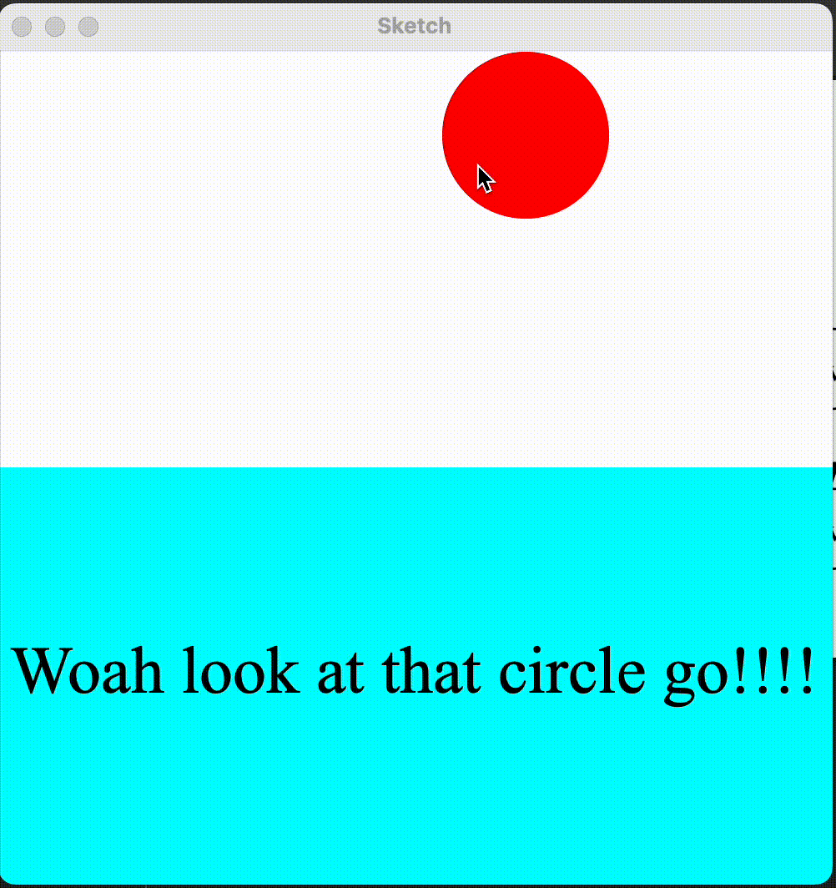

# Py5 Layout

Py5 Layout is a library that extends Py5 with a python based markup language. Styles are mirrored from CSS. The library is compatible with your normal python workflow/libraries. You can use logic defined in python to control the layout and the styles.

Example:

```python
import py5
from py5_layout import Py5Layout, Div, Style
from math import sin, cos
from time import time
width_ = 500
height_ = 500
layout = None
def setup():
    global width_, height_, layout
    py5.size(width_, height_)
    layout = Py5Layout(style=Style(background_color=(255,255,255), width="100%", height="100%"), width=width_, height=height_)

count = 0
def draw():
    global count, last_print_time
    count += 1
    with layout:
        with Div(style=Style(background_color=(127*sin(count/10), 0, 127*cos(count/10)), width=count//2, height="50%")):
            with Div(style=Style(background_color=(0,255,0))):
                Div(style=Style(background_color=(255,0,0)))

py5.run_sketch()
```

This creates the following animated layout:


## Installation

Install the library:

```bash
pip install py5-layout
```

Follow instructions to install Java 17 from py5's website [here](https://py5coding.org/content/install.html#install-java)

## Usage

In this library, the `with` statement is used to create a layout context.

```python
from py5_layout import *

layout = None
def setup():
    py5.size(500, 500)
    global layout
    layout = Py5Layout(style=Style(background_color=(255,255,255), width="100%", height="100%"), width=width_, height=height_)
def draw():
    with layout:
        with Div(style=Style(background_color="red", width="100%", height="100%")):
            with Div(style=Style(background_color="green")):
                Div(style=Style(background_color="blue"))
```

is equivalent to:

```html
<div style="background-color: red; width: 100%; height: 100%;">
  <div style="background-color: green;">
    <div style="background-color: blue;"></div>
  </div>
</div>
```

You can use python logic to control the layout and styles.

```python
from py5_layout import *
count = 0
layout = None
def setup():
    global layout
    layout = Py5Layout(style=Style(background_color=(255,255,255), width="100%", height="100%"), width=width_, height=height_)
def draw():
    global count
    count += 1
    show_green = count % 50 < 25
    with layout:
        with Div(style=Style(background_color="red", width=f"{count%100}%", height="100%")):
            if show_green:
                with Div(style=Style(background_color="green")):
                    Div(style=Style(background_color="blue"))
```

You can also embed custom animations and renderings into the layout. See the [custom sketch example](./examples/custom_sketch.py)

```python
import py5
from py5_layout import Py5Layout, Div, Style, Text, Element
from math import sin, cos
from time import time
width_ = 500
height_ = 500
layout = None
last_print_time = 0

class CustomSketch(Element):
    def __init__(self, circle_radius: int, circle_color: tuple, **kwargs):
        super().__init__(**kwargs)
        self.circle_radius = circle_radius
        self.circle_color = circle_color

    def draw(self):
        with self.canvas(set_origin=False, clip=True):
            py5.fill(*self.circle_color)
            py5.circle(py5.mouse_x, py5.mouse_y, self.circle_radius)


def setup():
    global width_, height_, layout
    py5.size(width_, height_)
    layout = Py5Layout(style=Style(background_color=(255,255,255), width="100%", height="100%"), width=width_, height=height_)

count = 0
def draw():
    py5.no_stroke()
    global count, last_print_time
    count += 1
    with layout:
        CustomSketch(circle_radius=100,
                        circle_color=(255,0,0),
                        style=Style(background_color=(255,255,255),flex=1), width=width_, height=height_)
        with Div(style=Style(background_color="cyan", width="100%", height="50%", justify_content="center", align_items="center", align_content="center", font_size=40), name="div2"):
            Text("Woah look at that circle go!!!!")
py5.run_sketch()
```

this renders the following:


## Reference

- Div: A container element that can contain other elements.
- Text: A text element that can be used to display text.
- Style: A style object that can be used to style the layout.
- Py5Layout: The main layout object that can be used to create the layout.
- Element: The base class for all elements.

**coming soon**

- Button
- Switch
- Slider
- Checkbox

Todo:

- [x] Style inheritance
- [x] Style Merging
- [x] Text element
- [x] color keyword arguments (black, white, red, green, blue, etc.)
- [ ] hover, focus, etc. pseudo-classes
- [ ] Button element
- [ ] rem, em, vw, vh, etc. units
- [ ] CSS Classes and ids
- [ ] CSS Files
- [ ] CSS Variables
- [ ] Style type checking

```

```
