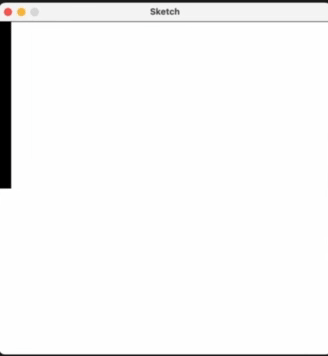

# Py5 Layout

Py5 Layout is a library that extends Py5 with a python based markup language. Styles are mirrored from CSS. The library is compatible with your normal python workflow/libraries. You can use logic defined in python to control the layout and the styles.

Example:

```python
import py5
from py5_layout import Py5Layout, Div, Style
from math import sin, cos
from time import time
width_ = 500
height_ = 500
layout = None
def setup():
    global width_, height_, layout
    py5.size(width_, height_)
    layout = Py5Layout(style=Style(background_color=(255,255,255), width="100%", height="100%"), width=width_, height=height_)

count = 0
def draw():
    global count, last_print_time
    count += 1
    with layout:
        with Div(style=Style(background_color=(127*sin(count/10), 0, 127*cos(count/10)), width=count//2, height="50%")):
            with Div(style=Style(background_color=(0,255,0))):
                Div(style=Style(background_color=(255,0,0)))

py5.run_sketch()
```

This creates the following animated layout:



Todo:

- [ ] Style inheritance
- [ ] Style Merging
- [ ] Text element
- [ ] hover, focus, etc. pseudo-classes
- [ ] Button element
- [ ] rem, em, vw, vh, etc. units
- [ ] CSS Classes and ids
- [ ] CSS Files
- [ ] CSS Variables
- [ ] Style type checking
- [ ] color keyword arguments (black, white, red, green, blue, etc.)
